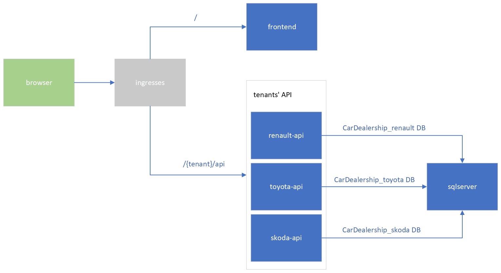

# Car Dealership - Docker, Kubernetes and Helm demo`

## Overview
An multitenant application created for educational purposes representing a simple software for a car dealership that consists of a frontend, backend and SQL persistence.

### Graphical overview of the system


`
## Acheived goals
- Hands on experience with Docker
- Hands on experience with docker-compose
- Hands on experience with Kubernetes
- A full stack system composed of the frontend, API and persistence
- The system was contenerized
- The docker-compose.yaml file created to setup local development environment easily
- The system was hosted on Kubernetes with use of deployments and service IP
- Ingress installed and configured
- The system has variable number of environments and tenants per each environment easily configurable through the yaml files located under /helm/car-dealership/values.

## Technology stack
- Docker 20.10
- Kubernetes 1.22, provided by Docker Desktop
- Helm 3.8
- ASP.NET 6
- SQL Server 19
- React 17 on hooks

## Demo

### Local development environment
To setup the environment locally, run following command from the repo root
```bash
docker-compose -f docker-compose.development.yml up
```

### Kubernetes hosting
- Install Ingress provided by [kubernetes/ingress-nginx](https://github.com/kubernetes/ingress-nginx/) on the chosen platform. My platform of choice was k8s shipped with Docker Desktop, so this command set it up
```
kubectl apply -f https://raw.githubusercontent.com/kubernetes/ingress-nginx/controller-v1.3.0/deploy/static/provider/cloud/deploy.yaml
```
- Then you might want to reroute ingress base url so that it doesn't interfere with my local IIS. Mind that it works only as long as the process is running.
```
kubectl port-forward --namespace=ingress-nginx service/ingress-nginx-controller 5080:80
```

## Helm

### Test template
```
cd helm
helm install --dry-run --generate-name --debug car-dealership -f ./car-dealership/values/values.yaml -f ./car-dealership/values/envs/values.local-k8s.yaml
```

### Install chart
```
cd helm
helm upgrade car-dealership-renault car-dealership --namespace car-dealership --create-namespace --atomic --timeout 5m --debug --install -f ./car-dealership/values/values.yaml -f ./car-dealership/values/envs/values.local-k8s.yaml
``` 

### Clean up k8s cluster from all resources from this repo
```
kubectl delete namespaces car-dealership
```